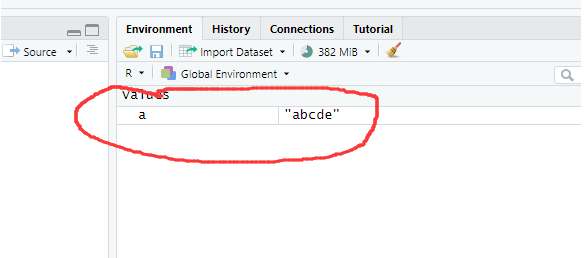
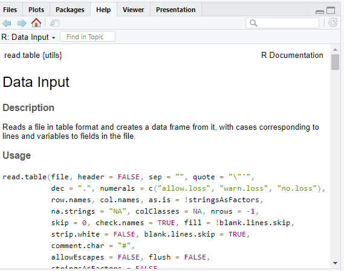
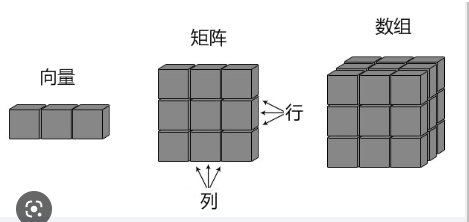
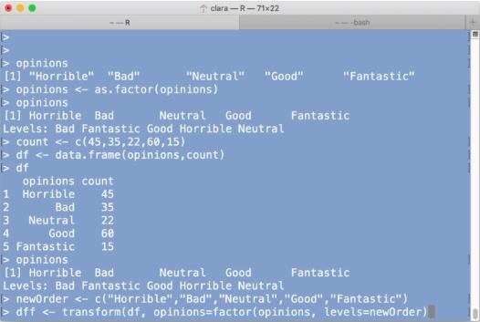
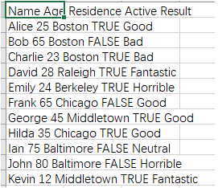
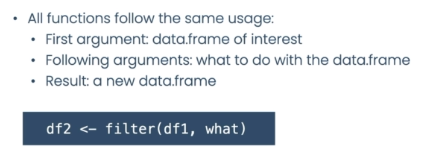
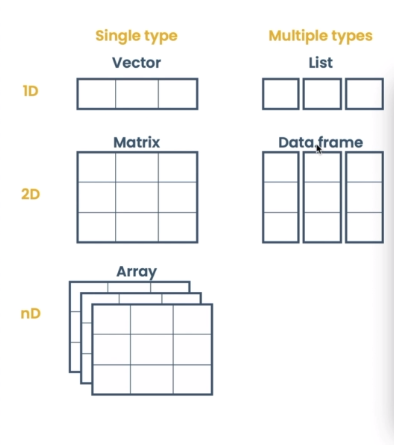

## R语言与安装

**什么是R语言？**

R语言是一门专门用来进行统计分析的语言。

**怎么安装R语言和编译器？**

R语言：https://www.r-project.org/


RStudio：https://posit.co/download/rstudio-desktop/


## 第一步

创建项目：


获得当前的目录：

```
> getwd()
[1] "C:/Users/yinia/Desktop/ggplot2-notes/CrashCourseForR"
```

如果要设置目录，则使用setwd()，注意在windows之下，路径需要使用 \ 而不是 \。

创建第一个变量：

```
> # 一个变量
> a <- "abcde"
> a
[1] "abcde"
```

在右上角可以发现：



我们可以移除这个变量：


我们可以使用ls()罗列环境中的变量：

```
> b <- "bcde"
> ls()
[1] "b"
```

使用rm()也可以起到和remove()同样的效果：

```
# 移除
rm(b)
```

如果要注释，则使用#来进行注释：

```
# 进行注释
```

赋值有两个方法：

1. a = 123
2. a <- 123

这两个方法在R语言中都是可以起到赋值的作用，但是R语言通常使用的是第二种方法，使用第一种方法会被认为是不专业的。

如果要进行判断，则使用 == 来实现。

倘若我们不知道某一个函数的作用是什么，则可以使用?来进行查询：

```
?read.csv()
```

在右下角可以发现：



打印则使用print()来实现：

```
> # 打印
> print("Hello R Programming")
[1] "Hello R Programming"
```

另一个更加复杂一点儿的方法是使用cat()函数：

```
> # cat()打印
> a <- "R"
> cat("Hello ", a, "programming.")
Hello  R programming.
```

我们需要使用ggplot2，所以可以安装这个包：

```
# 安装ggplot2
install.packages(ggplot2)
```

接着进行加载：

```
> library(ggplot2)
Warning message:
程辑包‘ggplot2’是用R版本4.2.2 来建造的
```

然后使用R语言内置的数据集：

```
mpg
```

得到的结果为：

```
> # 内置数据集
> mpg
# A tibble: 234 × 11
   manufacturer model      displ  year   cyl trans      drv     cty   hwy fl    class  
   <chr>        <chr>      <dbl> <int> <int> <chr>      <chr> <int> <int> <chr> <chr>  
 1 audi         a4           1.8  1999     4 auto(l5)   f        18    29 p     compact
 2 audi         a4           1.8  1999     4 manual(m5) f        21    29 p     compact
 3 audi         a4           2    2008     4 manual(m6) f        20    31 p     compact
 4 audi         a4           2    2008     4 auto(av)   f        21    30 p     compact
 5 audi         a4           2.8  1999     6 auto(l5)   f        16    26 p     compact
 6 audi         a4           2.8  1999     6 manual(m5) f        18    26 p     compact
 7 audi         a4           3.1  2008     6 auto(av)   f        18    27 p     compact
 8 audi         a4 quattro   1.8  1999     4 manual(m5) 4        18    26 p     compact
 9 audi         a4 quattro   1.8  1999     4 auto(l5)   4        16    25 p     compact
10 audi         a4 quattro   2    2008     4 manual(m6) 4        20    28 p     compact
# … with 224 more rows
# ℹ Use `print(n = ...)` to see more rows
```

## 基本类型和向量

R语言的data types有五中：

1. Character
2. Numeric (double)
3. Integer
4. Complex
5. Logical

可以使用typeof来进行查看：

```
num = 123456
typeof(num)
```

得到的结果为：

```
"double"
```

然后测试多种情况：

```
> num = 123456
> typeof(num)
[1] "double"
> chr = "abcde"
> typeof(chr)
[1] "character"
> num_2 = 123.0
> typeof(num_2)
[1] "double"
> class(num_2)
[1] "numeric"
> int_num <- 1L
> typeof(int_num)
[1] "integer"
> complex_num <- 1 + 1
> typeof(complex_num)
[1] "double"
> complex_num <- 0 + 1i
> typeof(complex_num)
[1] "complex"
> bool_value = TRUE
> typeof(bool_value)
[1] "logical"
```

R语言内置的data strctures有五种：

1. Vectors
2. Lists
3. Matrices
4. Arrays
5. Data.frames

创建Vectors：

```
> # vectors
> v1 <- c(1, 2, 3, 4, 5)
> typeof(v1)
[1] "double"
> class(v1)
[1] "numeric"
```

测试另一种情况：

```
> v2 <- c("a", "b", "c", "d")
> typeof(v2)
[1] "character"
> class(v2)
[1] "character"
```

或者我们可以这样做：

```
> # 指令生成
> num_vector <- vector("numeric", length = 5)
> num_vector
[1] 0 0 0 0 0
```

使用广播机制：

```
> num_vector + 10
[1] 10 10 10 10 10
> num_vector
[1] 0 0 0 0 0
```

使用is.vector()来判断是否是Vector：

```
> is.vector(num_vector)
[1] TRUE
```

使用切割来获得对应位置的元素：

```
> # 使用 : 来进行切割
> vector_char <- c(1, 2, 3, 4, 5, 6, 7, 8)
> vector_char
[1] 1 2 3 4 5 6 7 8
> vector_char[2, 4]
Error in vector_char[2, 4] : incorrect number of dimensions
> vector_char[2:4]
[1] 2 3 4
```

使用:来进行生成：

```
> # 使用 : 来进行生成
> vector_num <- c(1:10)
> vector_num
 [1]  1  2  3  4  5  6  7  8  9 10
```

或者去除特定位置的元素：

```
> # 使用 -n 来排除位于 n 位置的元素
> vector_num[-2]
[1]  1  3  4  5  6  7  8  9 10
```

或者使用c()来指定去除多个位置的元素：

```
> # 使用c()来去除多个位置的元素
> vector_num[c(-1, -3, -5)]
[1]  2  4  6  7  8  9 10
```

同样的还可以使用c()来获得指定位置的多个元素：

```
> vector_num[c(1, 4, 6, 9, 2)]
[1] 1 4 6 9 2
```

对已有的元素进行修改：

```
> # 修改值
> vector_char <- c("A", "B", "C")
> vector_char
[1] "A" "B" "C"
```

修改某一个元素：

```
> vector_char[1] <- "Modify"
> vector_char
[1] "Modify" "B"      "C"
```

添加新元素：

```
> vector_char <- c(vector_char, "D")
> vector_char
[1] "Modify" "B"      "C"      "D"
```

考虑一下混合classes的情况：

```
> # mixing classes
> vector_mix <- c(TRUE, "Hello")
> vector_mix
[1] "TRUE"  "Hello"
> vector_mix_2 <- c(1, FALSE)
> vector_mix_2
[1] 1 0
```

使用class来查看一下：

```
> class(vector_mix)
[1] "character"
> class(vector_mix_2)
[1] "numeric"
```

如果要对两个vectors进行对比，则这两个vectors需要在类型上相同：

```
> vector_1 <- c(1, 2, 3, 4, 5)
> typeof(vector_1)
[1] "double"
> class(vector_1)
[1] "numeric"
> vector_2 <- c("1", "2", "3", "4", "5")
> typeof(vector_2)
[1] "character"
> class(vector_2)
[1] "character"
> vector_1 == vector_2
[1] TRUE TRUE TRUE TRUE TRUE
```

使用length()来查看一下长度：

```
> length(vector_1)
[1] 5
```

dim()给出来的结果则是NULL：

```
> dim(vector_1)
NULL
```

可以直接链接两个vectors：

```
> vector_1 <- c(1, 2, 3, 4, 5)
> vector_2 <- c(6, 7, 8, 9, 10)
> vector_com <- c(vector_1, vector_2)
> vector_com
 [1]  1  2  3  4  5  6  7  8  9 10
```

## R lists

在R语言中，vector会强制元素类型的相同，但是list则允许使用不同类型的元素：

```
> # R list
> l <- list()
> class(l)
[1] "list"
```

使用list来链接：

```
> l <- list("Johm", 72, TRUE)
> l
[[1]]
[1] "Johm"

[[2]]
[1] 72

[[3]]
[1] TRUE

> v <- c(1, 2, 3)
> l <- list(l, v)
> l
[[1]]
[[1]][[1]]
[1] "Johm"

[[1]][[2]]
[1] 72

[[1]][[3]]
[1] TRUE

[[2]]
[1] 1 2 3
```

进行访问：

```
> l[[1]][[2]]
[1] 72
```

这样过于麻烦了，所以做好的方法是进行命名。

## Matrices 基础

首先生成一个matrix：

```
> x <- matrix(1:12, nrow = 4, ncol = 3)
> x
     [,1] [,2] [,3]
[1,]    1    5    9
[2,]    2    6   10
[3,]    3    7   11
[4,]    4    8   12
```

1:12指出了生成的数据的开始和结束，nrow=4指出总共有4行，ncol=3则指出总共有3列。

从输出的结果来看，可以发现在进行填充的时候是按照列来进行填充的，当然这是可以修改的：

```
x <- matrix(1:12, nrow = 4, ncol = 3, byrow = TRUE)
x
```

byrow = TREU指出会按照行来进行排序。

我们填充数据和需要的数据不匹配的情况：

```
> y <- matrix(1:13, nrow = 4, ncol = 3)
Warning message:
In matrix(1:13, nrow = 4, ncol = 3) :
  data length [13] is not a sub-multiple or multiple of the number of rows [4]
```

可以发现会报错。

再尝试一下：

```
> y <- matrix(1:16, nrow = 4, ncol = 3)
Warning message:
In matrix(1:16, nrow = 4, ncol = 3) :
  data length [16] is not a sub-multiple or multiple of the number of columns [3]
> y
     [,1] [,2] [,3]
[1,]    1    5    9
[2,]    2    6   10
[3,]    3    7   11
[4,]    4    8   12
```

还有另一种情况：

```
> z <- matrix(1:12, nrow = 4, ncol = 4)
Warning message:
In matrix(1:12, nrow = 4, ncol = 4) :
  data length differs from size of matrix: [12 != 4 x 4]
> z
     [,1] [,2] [,3] [,4]
[1,]    1    5    9    1
[2,]    2    6   10    2
[3,]    3    7   11    3
[4,]    4    8   12    4
```

被填充的也可以使用字符串：

```
> j <- matrix("Hello", nrow= 4, ncol = 4)
> j
     [,1]    [,2]    [,3]    [,4]   
[1,] "Hello" "Hello" "Hello" "Hello"
[2,] "Hello" "Hello" "Hello" "Hello"
[3,] "Hello" "Hello" "Hello" "Hello"
[4,] "Hello" "Hello" "Hello" "Hello"
```

我们还可以给matrix列名和行名：

```
myrows <- c("A", "B", "C", "D")
mycols <- c("col1", "col2", "col3", "col4")

matrix_1 <- matrix(1:16, nrow = 4, ncol = 4, dimnames = list(myrows, mycols))
matrix_1
```

这一段的核心在于：dimnames = list(myrows, mycols。

我们可以查看一个matrix的行名和列名：

```
> colnames(matrix_1)
[1] "col1" "col2" "col3" "col4"
> rownames(matrix_1)
[1] "A" "B" "C" "D"
```

我们可以修改已有的列名：

```
> rownames(matrix_1)[4] <- "ZZ"
> rownames(matrix_1)
[1] "A"  "B"  "C"  "ZZ"
```

我们可以直接使用数字来方位对应位置的元素：

```
> matrix_1[6]
[1] 6
```

可以发现使用单个数字可以范围，按照列来排序。

或者我们可以使用行+列来进行访问：

```
> matrix_1[2, 3]
[1] 10
```

一整行：

```
> matrix_1[1, ]
col1 col2 col3 col4 
   1    5    9   13
```

两整行：

```
> matrix_1[c(1, 3), ]
  col1 col2 col3 col4
A    1    5    9   13
C    3    7   11   15
```

或者反选：

```
> matrix_1[c(-1, -4), ]
  col1 col2 col3 col4
B    2    6   10   14
C    3    7   11   15
```

使用行名和列名：

```
> matrix_1["A", "col3"]
[1] 9
```

或者：

```
> matrix_1["A", ]
col1 col2 col3 col4 
   1    5    9   13
```

R语言提供了t()来进行旋转：

```
> matrix_1
   col1 col2 col3 col4
A     1    5    9   13
B     2    6   10   14
C     3    7   11   15
ZZ    4    8   12   16
> t(matrix_1)
      A  B  C ZZ
col1  1  2  3  4
col2  5  6  7  8
col3  9 10 11 12
col4 13 14 15 16
```

R语言还提供了cbind()和rbind()来对两个举证进行合并：

```
> cbind(matrix_1, c(17, 18, 19, 20))
   col1 col2 col3 col4   
A     1    5    9   13 17
B     2    6   10   14 18
C     3    7   11   15 19
ZZ    4    8   12   16 20
```

按照行：

```
> rbind(matrix_1, "D" = c(111, 222, 333, 444, 555))
   col1 col2 col3 col4
A     1    5    9   13
B     2    6   10   14
C     3    7   11   15
ZZ    4    8   12   16
D   111  222  333  444
Warning message:
In rbind(matrix_1, D = c(111, 222, 333, 444, 555)) :
  number of columns of result is not a multiple of vector length (arg 2)
```

使用dim()来查看举证的大小：

```
> dim(matrix_1)
[1] 4 4
```

或者可以使用dim来修改举证的大小：

```
> dim(matrix_1) <- c(2, 8)
> matrix_1
     [,1] [,2] [,3] [,4] [,5] [,6] [,7] [,8]
[1,]    1    3    5    7    9   11   13   15
[2,]    2    4    6    8   10   12   14   16
```

## Array基础

数组（array）是多维对象。

```
> # array
> array_01 <- array(1:18, dim = c(3, 3, 2))
> array_01
, , 1

     [,1] [,2] [,3]
[1,]    1    4    7
[2,]    2    5    8
[3,]    3    6    9

, , 2

     [,1] [,2] [,3]
[1,]   10   13   16
[2,]   11   14   17
[3,]   12   15   18
```

这是一个可视化的例子：



可以使用[]来进行访问：

```
> array_01
, , 1

     [,1] [,2] [,3]
[1,]    1    4    7
[2,]    2    5    8
[3,]    3    6    9

, , 2

     [,1] [,2] [,3]
[1,]   10   13   16
[2,]   11   14   17
[3,]   12   15   18

> array_01[1, , 1]
[1] 1 4 7
```

[x, y, z]三个参数：

1. x：第几行
2. y：第几列
3. z：第几个维度的matrix

## DataFrame 基础

数据框是等向量的列表，因此数据框是二维的，有行和列。

```
data.frame()  # 数据框
```

一个例子：

```
> df <- data.frame(x = 1:3, y = 3:1)
> df
  x y
1 1 3
2 2 2
3 3 1
```

这是一个更加具体的例子：

```
> person_names <- c("Alice", "Bob", "Charlie", "David")
> ages <- c(45, 35, 25, 60)
> df <- data.frame(person_names, ages)
> df
  person_names ages
1        Alice   45
2          Bob   35
3      Charlie   25
4        David   60
```

我们来查看一下person_names这个对象的属性：

```
> typeof(df)
[1] "list"
> class(df)
[1] "data.frame"
```

我们可以对vector进行转变，将其转换为DataFrame：

```
> vec_03 <- c(1, 2, 3, 4, 5, 6)
> as.data.frame(vec_03)
  vec_03
1      1
2      2
3      3
4      4
5      5
6      6
```

使用`length()`来查看DataFrame，得到的结果是DataFrame的列数。

```
> length(df)
[1] 2
```

或者我们也可以使用nrow()和ncol()来查看：

```
> nrow(df)
[1] 4
> ncol(df)
[1] 2
```

R语言内置了一个数据集cars：

```
> cars
   speed dist
1      4    2
2      4   10
3      7    4
4      7   22
5      8   16
6      9   10
7     10   18
8     10   26
9     10   34
10    11   17
11    11   28
12    12   14
13    12   20
14    12   24
15    12   28
16    13   26
17    13   34
18    13   34
19    13   46
20    14   26
21    14   36
22    14   60
23    14   80
24    15   20
25    15   26
26    15   54
27    16   32
28    16   40
29    17   32
30    17   40
31    17   50
32    18   42
33    18   56
34    18   76
35    18   84
36    19   36
37    19   46
38    19   68
39    20   32
40    20   48
41    20   52
42    20   56
43    20   64
44    22   66
45    23   54
46    24   70
47    24   92
48    24   93
49    24  120
50    25   85
```

我们并不希望将所有的内容都打印出来，而是数据集的开头的一部分：

```
> head(cars, n = 10)
   speed dist
1      4    2
2      4   10
3      7    4
4      7   22
5      8   16
6      9   10
7     10   18
8     10   26
9     10   34
10    11   17
```

或者最后的一部分：

```
> tail(cars, n = 10)
   speed dist
41    20   52
42    20   56
43    20   64
44    22   66
45    23   54
46    24   70
47    24   92
48    24   93
49    24  120
50    25   85
```

接着我们开始进行处理：

```
> cars_df <- cars
> head(cars_df)
  speed dist
1     4    2
2     4   10
3     7    4
4     7   22
5     8   16
6     9   10
> tail(cars_df)
   speed dist
45    23   54
46    24   70
47    24   92
48    24   93
49    24  120
50    25   85
> # 查看cars数据集的速度列
> cars_df$speed
 [1]  4  4  7  7  8  9 10 10 10 11 11 12 12 12 12 13 13 13 13 14 14 14 14
[24] 15 15 15 16 16 17 17 17 18 18 18 18 19 19 19 20 20 20 20 20 22 23 24
[47] 24 24 24 25
> # 查看cars数据集的dist列
> cars_df$dist
 [1]   2  10   4  22  16  10  18  26  34  17  28  14  20  24  28  26  34
[18]  34  46  26  36  60  80  20  26  54  32  40  32  40  50  42  56  76
[35]  84  36  46  68  32  48  52  56  64  66  54  70  92  93 120  85
```

或者也可以使用[]来进行访问：

```
> cars_df["speed"]
   speed
1      4
2      4
3      7
4      7
5      8
6      9
7     10
8     10
9     10
10    11
11    11
12    12
13    12
14    12
15    12
16    13
17    13
18    13
19    13
20    14
21    14
22    14
23    14
24    15
25    15
26    15
27    16
28    16
29    17
30    17
31    17
32    18
33    18
34    18
35    18
36    19
37    19
38    19
39    20
40    20
41    20
42    20
43    20
44    22
45    23
46    24
47    24
48    24
49    24
50    25
```

最开始的是索引列。

有必要注意的地方在于：

```
> class(cars_df["speed"])
[1] "data.frame"
> class(cars_df$speed)
[1] "numeric"
```

由此可以看出，cars_df$speed返回的其实是一个vector，而cars_df[”speed”]返回的则是DataFrame。

我们可以在括号中给出一个条件判断，用来将符合条件的数据选择出来：

```
> cars_df[cars_df$speed <= 7]
Error in `[.data.frame`(cars_df, cars_df$speed <= 7) : 选择了未定义的列
```

可以发现这回导致错误，但是可以这样写：

```
> cars_df[cars_df$speed <= 7, ]
  speed dist
1     4    2
2     4   10
3     7    4
4     7   22
```

或者给出多个判断条件：

```
> cars_df[(cars_df$speed <= 7 & cars_df$dist >= 10), ]
  speed dist
2     4   10
4     7   22
```

还有就是：

```
> cars_df[cars_df$speed == 7, ]
  speed dist
3     7    4
4     7   22
```

## Factors 基础

factor，因子，是一种特殊的变量，是一个向量，但是只包含预定义的值。

可以将其是为是别的编程语言中的枚举。

factor有两个部分：

1. labels：the values
2. the levels：define the set of allowed values

首先开始定义一个因子：

```
> # factor
> x <- factor(c("AA", "BB", "CC"), levels = c("AA", "BB", "CC"))
> x
[1] AA BB CC
Levels: AA BB CC
```

使用is.factor()：

```
> is.factor(x)
[1] TRUE
```

使用class可以查看对象的类型：

```
> class(x)
[1] "factor"
```

如果在levels中添加”DD”会怎么样？

```
> x <- factor(c("AA", "BB", "CC", "DD"), levels = c("AA", "BB", "CC"))
> x
[1] AA   BB   CC   <NA>
Levels: AA BB CC
```

如果在添加一个“BB”呢？

```
> x <- factor(c("AA", "BB", "CC", "BB"), levels = c("AA", "BB", "CC"))
> x
[1] AA BB CC BB
Levels: AA BB CC
```

levels出现的前后顺序，取决于单词的字母的前后顺序。

在R语言中，可以使用`factor()`函数来指定factor中level的前后顺序，具体方法如下：

```
# 定义一个factor
x <- factor(c("A", "B", "C"), levels = c("C", "B", "A"))
x
```

其中，`levels`参数可以指定level的顺序，如上面的例子中，level的顺序是”C”, “B”, “A”。

`transform(df, opinions = factor())`的功能是向数据框df中添加一个名为opinions的列，该列的值将被定义为一个因子（factor）。但是，因子的具体值是未定义的，需要在factor()函数中指定。

这一部分的一个重点：



## 读取数据集

R的base package提供了两种方式来读取数据集：

1. read.table()
2. read.csv()

`read.csv()`是`read.table()`的一个特殊情况。`read.csv()`只是一个简化的版本，它默认使用逗号作为分隔符，而`read.table()`需要明确指定分隔符。因此，当使用逗号作为分隔符时，推荐使用`read.csv()`。

这里使用数据集，readSample.csv：

```
sample_df <- read.table("readSample.csv")
sample_df
```

首先确认一下是否是DataFrame：

```
> is.data.frame(sample_df)
[1] TRUE
```

如果要查看第一列，可以这样做：

```
> sample_df$V1
 [1] "Name"    "Alice"   "Bob"     "Charlie" "David"   "Emily"   "Frank"  
 [8] "George"  "Hilda"   "Ian"     "John"    "Kevin"
```

接着需要关注的是header参数，默认情况之下header = FALSE，这样一来导入的数据的第一行不会被识别为header，我们可以修改为TRUE：

```
> sample_df <- read.table("readSample.csv", header =  TRUE)
> head(sample_df)
     Name Age Residence Active    Result
1   Alice  25    Boston   TRUE      Good
2     Bob  65    Boston  FALSE       Bad
3 Charlie  23    Boston   TRUE       Bad
4   David  28   Raleigh   TRUE Fantastic
5   Emily  24  Berkeley   TRUE  Horrible
6   Frank  65   Chicago  FALSE      Good
```

除此之外，还有一个重要的参数是sep，sep的意思是string indicating separator, 默认情况下是“ ”，所以当数据集如下所示的时候：



还是被正确的导入了。而read.csv()其实就是spe=”,”的read.table()函数。

还有一个重要的参数是 strings AsFactors，在这里，我们使用Residence来作为factor：


```
> sample_df <- read.table("readSample.csv", header = TRUE, stringsAsFactors = TRUE)
> class(sample_df$Residence)
[1] "factor"
```

可以发现，Residence已经被转换为factor了。

除此之外还有一些别的参数：

1. comment_char：character string indicating the comment character，默认为 #
2. nrows：number of rows to be read file，默认为 all
3. skip：number of lines to be skipped at the beginning，默认为0

## Transforming data with dplyr

dplyr是一个强大的R语言包，用于转换数据。它提供了一系列易于使用的函数，包括filter()、select()、arrange()和mutate()。

**filter()**



filter()函数用于筛选数据集中符合条件的行。条件通常是基于某个列的值，例如，你可以使用以下代码来选择年龄大于25岁的人：

```
library(dplyr)
data <- data.frame("Name" = c("Alice", "Bob", "Charlie"), "Age" = c(25, 65, 23))
filtered_data <- filter(data, Age > 25)
```

这将返回一个数据集，其中只包含年龄大于25岁的Bob。

**select()**

select()函数用于选择数据集中的特定列。你可以使用以下代码来选择名字和年龄列：

```
library(dplyr)
data <- data.frame("Name" = c("Alice", "Bob", "Charlie"), "Age" = c(25, 65, 23))
selected_data <- select(data, Name, Age)
```

这将返回一个包含Name和Age列的数据集。

**arrange()**

arrange()函数用于按照某个列的值对数据集进行排序。你可以使用以下代码按照年龄对数据集进行排序：

```
library(dplyr)
data <- data.frame("Name" = c("Alice", "Bob", "Charlie"), "Age" = c(25, 65, 23))
arranged_data <- arrange(data, Age)
```

这将返回一个按照年龄排序的数据集。

**mutate()**

mutate()函数用于添加一个新的列到数据集中。你可以使用以下代码来添加一个列，该列是年龄的两倍：

```
library(dplyr)
data <- data.frame("Name" = c("Alice", "Bob", "Charlie"), "Age" = c(25, 65, 23))
mutated_data <- mutate(data, DoubleAge = Age * 2)
```

这将返回一个包含名字、年龄和DoubleAge列的数据集。

**对transformSample数据集的操作尝试**

```
# 操作尝试
library(dplyr)
tf_df <- read.csv("transformSample.csv")
head(tf_df)
> str(tf_df)  # 使用str()查看数据框的结构
'data.frame':	11 obs. of  7 variables:
 $ Name     : chr  "Alice" "Bob" "Charlie" "David" ...
 $ Age      : int  25 65 23 28 24 65 45 35 75 80 ...
 $ Residence: chr  "Boston" "Boston" "Boston" "Raleigh" ...
 $ Active   : logi  TRUE FALSE TRUE TRUE TRUE FALSE ...
 $ Result   : chr  "Good" "Bad" "Bad" "Fantastic" ...
 $ Heights  : num  1.89 1.62 1.75 1.87 1.6 1.52 1.67 1.88 1.9 1.83 ...
 $ Weights  : int  82 74 80 52 78 77 68 83 61 73 ...
```

可以发现：

1. 有7个变量
2. 有11个被观察的结果

然后我们来使用前面的函数进行操作：

```
> # filter()函数
> filter(tf_df, Age < 35)
     Name Age  Residence Active    Result Heights Weights
1   Alice  25     Boston   TRUE      Good    1.89      82
2 Charlie  23     Boston   TRUE       Bad    1.75      80
3   David  28    Raleigh   TRUE Fantastic    1.87      52
4   Emily  24   Berkeley   TRUE  Horrible    1.60      78
5   Kevin  12 Middletown   TRUE Fantastic    1.55      51
```

filter(data_set, condition)，对于data_set，采取condition操作，返回一个DataFrame。

或者我们可以看一下这样的一个操作：

```
> tf_df[tf_df$Age < 35, ]
      Name Age  Residence Active    Result Heights Weights
1    Alice  25     Boston   TRUE      Good    1.89      82
3  Charlie  23     Boston   TRUE       Bad    1.75      80
4    David  28    Raleigh   TRUE Fantastic    1.87      52
5    Emily  24   Berkeley   TRUE  Horrible    1.60      78
11   Kevin  12 Middletown   TRUE Fantastic    1.55      51
```

可以发现这两者实际上是等价的。

但是在多条件选择的时候，filter()来的更加的方便：

```
> filter(tf_df, Age < 35, Residence == "Boston")
     Name Age Residence Active Result Heights Weights
1   Alice  25    Boston   TRUE   Good    1.89      82
2 Charlie  23    Boston   TRUE    Bad    1.75      80
```

如果不使用filter()来进行实现的话：

```
> tf_df[(tf_df$Age < 35 & tf_df$Residence == "Boston"), ] 
     Name Age Residence Active Result Heights Weights
1   Alice  25    Boston   TRUE   Good    1.89      82
3 Charlie  23    Boston   TRUE    Bad    1.75      80
```

可以发现后者的写法虽然能够得到和前者相同的结果，但是后者更容易出错。

我们可以再增加一个条件：

```
> filter(tf_df, Age < 35, Residence == "Boston" | Residence == "Middletown")
     Name Age  Residence Active    Result Heights Weights
1   Alice  25     Boston   TRUE      Good    1.89      82
2 Charlie  23     Boston   TRUE       Bad    1.75      80
3   Kevin  12 Middletown   TRUE Fantastic    1.55      51
```

另一个写法是使用%in%来进行：

```
> filter(tf_df, Age < 35, Residence %in% c("Boston", "Middletown"))
     Name Age  Residence Active    Result Heights Weights
1   Alice  25     Boston   TRUE      Good    1.89      82
2 Charlie  23     Boston   TRUE       Bad    1.75      80
3   Kevin  12 Middletown   TRUE Fantastic    1.55      51
```

接下来使用的是select()函数：

```
> select(tf_df, Age)
   Age
1   25
2   65
3   23
4   28
5   24
6   65
7   45
8   35
9   75
10  80
11  12
> select(tf_df, Age, Residence)
   Age  Residence
1   25     Boston
2   65     Boston
3   23     Boston
4   28    Raleigh
5   24   Berkeley
6   65    Chicago
7   45 Middletown
8   35    Chicago
9   75  Baltimore
10  80  Baltimore
11  12 Middletown
```

select()给出了一些有用的函数：

1. starts_with(”abc”)
2. ends_with(”xyz”)
3. contains(”ijk”)
4. everything()

我们可以先来测试一下starts_with：

```
> select(tf_df, starts_with("Res"))
    Residence    Result
1      Boston      Good
2      Boston       Bad
3      Boston       Bad
4     Raleigh Fantastic
5    Berkeley  Horrible
6     Chicago      Good
7  Middletown      Good
8     Chicago      Good
9   Baltimore   Neutral
10  Baltimore  Horrible
11 Middletown Fantastic
```

可以发现，所有的header的单词中包含了”Res”的列都被选择了出来。

同理ends_with()也是这样的工作原理：

```
> select(tf_df, ends_with("ts"))
   Heights Weights
1     1.89      82
2     1.62      74
3     1.75      80
4     1.87      52
5     1.60      78
6     1.52      77
7     1.67      68
8     1.88      83
9     1.90      61
10    1.83      73
11    1.55      51
```

rename_with则是修改名字：

```
> rename_with(tf_df, toupper)
      NAME AGE  RESIDENCE ACTIVE    RESULT HEIGHTS WEIGHTS
1    Alice  25     Boston   TRUE      Good    1.89      82
2      Bob  65     Boston  FALSE       Bad    1.62      74
3  Charlie  23     Boston   TRUE       Bad    1.75      80
4    David  28    Raleigh   TRUE Fantastic    1.87      52
5    Emily  24   Berkeley   TRUE  Horrible    1.60      78
6    Frank  65    Chicago  FALSE      Good    1.52      77
7   George  45 Middletown   TRUE      Good    1.67      68
8    Hilda  35    Chicago   TRUE      Good    1.88      83
9      Ian  75  Baltimore  FALSE   Neutral    1.90      61
10    John  80  Baltimore  FALSE  Horrible    1.83      73
11   Kevin  12 Middletown   TRUE Fantastic    1.55      51
```

通常来讲，select()会和filter()函数进行一起使用：

```
> select(filter(tf_df, Active == TRUE), Age)
  Age
1  25
2  23
3  28
4  24
5  45
6  35
7  12
```

其实是这样的一个步骤：

```
> filter(tf_df, Active == TRUE)
     Name Age  Residence Active    Result Heights Weights
1   Alice  25     Boston   TRUE      Good    1.89      82
2 Charlie  23     Boston   TRUE       Bad    1.75      80
3   David  28    Raleigh   TRUE Fantastic    1.87      52
4   Emily  24   Berkeley   TRUE  Horrible    1.60      78
5  George  45 Middletown   TRUE      Good    1.67      68
6   Hilda  35    Chicago   TRUE      Good    1.88      83
7   Kevin  12 Middletown   TRUE Fantastic    1.55      51
```

然后在这个DataFrame中将Age这一列select出来。

还有一种写法就是使用数据流来进行实现：

```
> filter(tf_df, Active == TRUE) %>% select(Age)
  Age
1  25
2  23
3  28
4  24
5  45
6  35
7  12
```

相当于先实现filter(tf_df, Active == TRUE)然后将结果传递给select(Age)进行再一次操作。

arrange()则进行排序：

```
> arrange(tf_df, Age)
      Name Age  Residence Active    Result Heights Weights
1    Kevin  12 Middletown   TRUE Fantastic    1.55      51
2  Charlie  23     Boston   TRUE       Bad    1.75      80
3    Emily  24   Berkeley   TRUE  Horrible    1.60      78
4    Alice  25     Boston   TRUE      Good    1.89      82
5    David  28    Raleigh   TRUE Fantastic    1.87      52
6    Hilda  35    Chicago   TRUE      Good    1.88      83
7   George  45 Middletown   TRUE      Good    1.67      68
8      Bob  65     Boston  FALSE       Bad    1.62      74
9    Frank  65    Chicago  FALSE      Good    1.52      77
10     Ian  75  Baltimore  FALSE   Neutral    1.90      61
11    John  80  Baltimore  FALSE  Horrible    1.83      73
```

可以发现按照Age的大小来进行了排序，从小到大。

如果要从大到小：

```
> arrange(tf_df, desc(Age))
      Name Age  Residence Active    Result Heights Weights
1     John  80  Baltimore  FALSE  Horrible    1.83      73
2      Ian  75  Baltimore  FALSE   Neutral    1.90      61
3      Bob  65     Boston  FALSE       Bad    1.62      74
4    Frank  65    Chicago  FALSE      Good    1.52      77
5   George  45 Middletown   TRUE      Good    1.67      68
6    Hilda  35    Chicago   TRUE      Good    1.88      83
7    David  28    Raleigh   TRUE Fantastic    1.87      52
8    Alice  25     Boston   TRUE      Good    1.89      82
9    Emily  24   Berkeley   TRUE  Horrible    1.60      78
10 Charlie  23     Boston   TRUE       Bad    1.75      80
11   Kevin  12 Middletown   TRUE Fantastic    1.55      51
```

desc()可以进行反序。

我们可以使用多个条件来进行排序：

```
> arrange(tf_df, Residence, Age)
      Name Age  Residence Active    Result Heights Weights
1      Ian  75  Baltimore  FALSE   Neutral    1.90      61
2     John  80  Baltimore  FALSE  Horrible    1.83      73
3    Emily  24   Berkeley   TRUE  Horrible    1.60      78
4  Charlie  23     Boston   TRUE       Bad    1.75      80
5    Alice  25     Boston   TRUE      Good    1.89      82
6      Bob  65     Boston  FALSE       Bad    1.62      74
7    Hilda  35    Chicago   TRUE      Good    1.88      83
8    Frank  65    Chicago  FALSE      Good    1.52      77
9    Kevin  12 Middletown   TRUE Fantastic    1.55      51
10  George  45 Middletown   TRUE      Good    1.67      68
11   David  28    Raleigh   TRUE Fantastic    1.87      52
```

首先按照Residence的值的首字母大小来进行排序，然后按照Age的大小来进行排序。

## 处理缺失值

在R语言中，NA表示”not available”，NaN表示”not a number”。

NA是指值确实或者未知，通常在数据缺失的情况下使用。例如，如果某个变量没有收集到值，那么这个变量就是NA。

NaN是指无法进行数值计算或者结果为无穷大或无穷小的情况。例如，0/0会返回NaN，1/0会返回Inf或者-Infinity。

在进行数据分析时，需要考虑如何处理NA和NaN。常用的处理方式包括删除或替换缺失值。可以使用is.na()和complete.cases()函数来检查缺失值，使用na.omit()函数来删除缺失值，使用mean()或median()函数来替换缺失值。

这里使用airquality数据集，这个数据集被包含在了R语言当中：

```
> air_df <- airquality
> air_df
    Ozone Solar.R Wind Temp Month Day
1      41     190  7.4   67     5   1
2      36     118  8.0   72     5   2
3      12     149 12.6   74     5   3
4      18     313 11.5   62     5   4
5      NA      NA 14.3   56     5   5
6      28      NA 14.9   66     5   6
7      23     299  8.6   65     5   7
8      19      99 13.8   59     5   8
9       8      19 20.1   61     5   9
10     NA     194  8.6   69     5  10
11      7      NA  6.9   74     5  11
12     16     256  9.7   69     5  12
13     11     290  9.2   66     5  13
14     14     274 10.9   68     5  14
15     18      65 13.2   58     5  15
16     14     334 11.5   64     5  16
17     34     307 12.0   66     5  17
18      6      78 18.4   57     5  18
19     30     322 11.5   68     5  19
20     11      44  9.7   62     5  20
21      1       8  9.7   59     5  21
22     11     320 16.6   73     5  22
23      4      25  9.7   61     5  23
24     32      92 12.0   61     5  24
25     NA      66 16.6   57     5  25
26     NA     266 14.9   58     5  26
27     NA      NA  8.0   57     5  27
28     23      13 12.0   67     5  28
29     45     252 14.9   81     5  29
30    115     223  5.7   79     5  30
31     37     279  7.4   76     5  31
32     NA     286  8.6   78     6   1
33     NA     287  9.7   74     6   2
34     NA     242 16.1   67     6   3
35     NA     186  9.2   84     6   4
36     NA     220  8.6   85     6   5
37     NA     264 14.3   79     6   6
38     29     127  9.7   82     6   7
39     NA     273  6.9   87     6   8
40     71     291 13.8   90     6   9
41     39     323 11.5   87     6  10
42     NA     259 10.9   93     6  11
43     NA     250  9.2   92     6  12
44     23     148  8.0   82     6  13
45     NA     332 13.8   80     6  14
46     NA     322 11.5   79     6  15
47     21     191 14.9   77     6  16
48     37     284 20.7   72     6  17
49     20      37  9.2   65     6  18
50     12     120 11.5   73     6  19
51     13     137 10.3   76     6  20
52     NA     150  6.3   77     6  21
53     NA      59  1.7   76     6  22
54     NA      91  4.6   76     6  23
55     NA     250  6.3   76     6  24
56     NA     135  8.0   75     6  25
57     NA     127  8.0   78     6  26
58     NA      47 10.3   73     6  27
59     NA      98 11.5   80     6  28
60     NA      31 14.9   77     6  29
61     NA     138  8.0   83     6  30
62    135     269  4.1   84     7   1
63     49     248  9.2   85     7   2
64     32     236  9.2   81     7   3
65     NA     101 10.9   84     7   4
66     64     175  4.6   83     7   5
67     40     314 10.9   83     7   6
68     77     276  5.1   88     7   7
69     97     267  6.3   92     7   8
70     97     272  5.7   92     7   9
71     85     175  7.4   89     7  10
72     NA     139  8.6   82     7  11
73     10     264 14.3   73     7  12
74     27     175 14.9   81     7  13
75     NA     291 14.9   91     7  14
76      7      48 14.3   80     7  15
77     48     260  6.9   81     7  16
78     35     274 10.3   82     7  17
79     61     285  6.3   84     7  18
80     79     187  5.1   87     7  19
81     63     220 11.5   85     7  20
82     16       7  6.9   74     7  21
83     NA     258  9.7   81     7  22
84     NA     295 11.5   82     7  23
85     80     294  8.6   86     7  24
86    108     223  8.0   85     7  25
87     20      81  8.6   82     7  26
88     52      82 12.0   86     7  27
89     82     213  7.4   88     7  28
90     50     275  7.4   86     7  29
91     64     253  7.4   83     7  30
92     59     254  9.2   81     7  31
93     39      83  6.9   81     8   1
94      9      24 13.8   81     8   2
95     16      77  7.4   82     8   3
96     78      NA  6.9   86     8   4
97     35      NA  7.4   85     8   5
98     66      NA  4.6   87     8   6
99    122     255  4.0   89     8   7
100    89     229 10.3   90     8   8
101   110     207  8.0   90     8   9
102    NA     222  8.6   92     8  10
103    NA     137 11.5   86     8  11
104    44     192 11.5   86     8  12
105    28     273 11.5   82     8  13
106    65     157  9.7   80     8  14
107    NA      64 11.5   79     8  15
108    22      71 10.3   77     8  16
109    59      51  6.3   79     8  17
110    23     115  7.4   76     8  18
111    31     244 10.9   78     8  19
112    44     190 10.3   78     8  20
113    21     259 15.5   77     8  21
114     9      36 14.3   72     8  22
115    NA     255 12.6   75     8  23
116    45     212  9.7   79     8  24
117   168     238  3.4   81     8  25
118    73     215  8.0   86     8  26
119    NA     153  5.7   88     8  27
120    76     203  9.7   97     8  28
121   118     225  2.3   94     8  29
122    84     237  6.3   96     8  30
123    85     188  6.3   94     8  31
124    96     167  6.9   91     9   1
125    78     197  5.1   92     9   2
126    73     183  2.8   93     9   3
127    91     189  4.6   93     9   4
128    47      95  7.4   87     9   5
129    32      92 15.5   84     9   6
130    20     252 10.9   80     9   7
131    23     220 10.3   78     9   8
132    21     230 10.9   75     9   9
133    24     259  9.7   73     9  10
134    44     236 14.9   81     9  11
135    21     259 15.5   76     9  12
136    28     238  6.3   77     9  13
137     9      24 10.9   71     9  14
138    13     112 11.5   71     9  15
139    46     237  6.9   78     9  16
140    18     224 13.8   67     9  17
141    13      27 10.3   76     9  18
142    24     238 10.3   68     9  19
143    16     201  8.0   82     9  20
144    13     238 12.6   64     9  21
145    23      14  9.2   71     9  22
146    36     139 10.3   81     9  23
147     7      49 10.3   69     9  24
148    14      20 16.6   63     9  25
149    30     193  6.9   70     9  26
150    NA     145 13.2   77     9  27
151    14     191 14.3   75     9  28
152    18     131  8.0   76     9  29
153    20     223 11.5   68     9  30
```

可以发现存在着较多的NA的值。

使用complete.cases()函数：

```
> complete.cases(air_df)
  [1]  TRUE  TRUE  TRUE  TRUE FALSE FALSE  TRUE  TRUE  TRUE FALSE FALSE
 [12]  TRUE  TRUE  TRUE  TRUE  TRUE  TRUE  TRUE  TRUE  TRUE  TRUE  TRUE
 [23]  TRUE  TRUE FALSE FALSE FALSE  TRUE  TRUE  TRUE  TRUE FALSE FALSE
 [34] FALSE FALSE FALSE FALSE  TRUE FALSE  TRUE  TRUE FALSE FALSE  TRUE
 [45] FALSE FALSE  TRUE  TRUE  TRUE  TRUE  TRUE FALSE FALSE FALSE FALSE
 [56] FALSE FALSE FALSE FALSE FALSE FALSE  TRUE  TRUE  TRUE FALSE  TRUE
 [67]  TRUE  TRUE  TRUE  TRUE  TRUE FALSE  TRUE  TRUE FALSE  TRUE  TRUE
 [78]  TRUE  TRUE  TRUE  TRUE  TRUE FALSE FALSE  TRUE  TRUE  TRUE  TRUE
 [89]  TRUE  TRUE  TRUE  TRUE  TRUE  TRUE  TRUE FALSE FALSE FALSE  TRUE
[100]  TRUE  TRUE FALSE FALSE  TRUE  TRUE  TRUE FALSE  TRUE  TRUE  TRUE
[111]  TRUE  TRUE  TRUE  TRUE FALSE  TRUE  TRUE  TRUE FALSE  TRUE  TRUE
[122]  TRUE  TRUE  TRUE  TRUE  TRUE  TRUE  TRUE  TRUE  TRUE  TRUE  TRUE
[133]  TRUE  TRUE  TRUE  TRUE  TRUE  TRUE  TRUE  TRUE  TRUE  TRUE  TRUE
[144]  TRUE  TRUE  TRUE  TRUE  TRUE  TRUE FALSE  TRUE  TRUE  TRUE
```

可以发现返回了一个列表，如果不是TRUE，则意味着这一行包含了NA值。

我们可以这么做：

```
> air_df[complete.cases(air_df), ]
    Ozone Solar.R Wind Temp Month Day
1      41     190  7.4   67     5   1
2      36     118  8.0   72     5   2
3      12     149 12.6   74     5   3
4      18     313 11.5   62     5   4
7      23     299  8.6   65     5   7
8      19      99 13.8   59     5   8
9       8      19 20.1   61     5   9
12     16     256  9.7   69     5  12
13     11     290  9.2   66     5  13
14     14     274 10.9   68     5  14
15     18      65 13.2   58     5  15
16     14     334 11.5   64     5  16
17     34     307 12.0   66     5  17
18      6      78 18.4   57     5  18
19     30     322 11.5   68     5  19
20     11      44  9.7   62     5  20
21      1       8  9.7   59     5  21
22     11     320 16.6   73     5  22
23      4      25  9.7   61     5  23
24     32      92 12.0   61     5  24
28     23      13 12.0   67     5  28
29     45     252 14.9   81     5  29
30    115     223  5.7   79     5  30
31     37     279  7.4   76     5  31
38     29     127  9.7   82     6   7
40     71     291 13.8   90     6   9
41     39     323 11.5   87     6  10
44     23     148  8.0   82     6  13
47     21     191 14.9   77     6  16
48     37     284 20.7   72     6  17
49     20      37  9.2   65     6  18
50     12     120 11.5   73     6  19
51     13     137 10.3   76     6  20
62    135     269  4.1   84     7   1
63     49     248  9.2   85     7   2
64     32     236  9.2   81     7   3
66     64     175  4.6   83     7   5
67     40     314 10.9   83     7   6
68     77     276  5.1   88     7   7
69     97     267  6.3   92     7   8
70     97     272  5.7   92     7   9
71     85     175  7.4   89     7  10
73     10     264 14.3   73     7  12
74     27     175 14.9   81     7  13
76      7      48 14.3   80     7  15
77     48     260  6.9   81     7  16
78     35     274 10.3   82     7  17
79     61     285  6.3   84     7  18
80     79     187  5.1   87     7  19
81     63     220 11.5   85     7  20
82     16       7  6.9   74     7  21
85     80     294  8.6   86     7  24
86    108     223  8.0   85     7  25
87     20      81  8.6   82     7  26
88     52      82 12.0   86     7  27
89     82     213  7.4   88     7  28
90     50     275  7.4   86     7  29
91     64     253  7.4   83     7  30
92     59     254  9.2   81     7  31
93     39      83  6.9   81     8   1
94      9      24 13.8   81     8   2
95     16      77  7.4   82     8   3
99    122     255  4.0   89     8   7
100    89     229 10.3   90     8   8
101   110     207  8.0   90     8   9
104    44     192 11.5   86     8  12
105    28     273 11.5   82     8  13
106    65     157  9.7   80     8  14
108    22      71 10.3   77     8  16
109    59      51  6.3   79     8  17
110    23     115  7.4   76     8  18
111    31     244 10.9   78     8  19
112    44     190 10.3   78     8  20
113    21     259 15.5   77     8  21
114     9      36 14.3   72     8  22
116    45     212  9.7   79     8  24
117   168     238  3.4   81     8  25
118    73     215  8.0   86     8  26
120    76     203  9.7   97     8  28
121   118     225  2.3   94     8  29
122    84     237  6.3   96     8  30
123    85     188  6.3   94     8  31
124    96     167  6.9   91     9   1
125    78     197  5.1   92     9   2
126    73     183  2.8   93     9   3
127    91     189  4.6   93     9   4
128    47      95  7.4   87     9   5
129    32      92 15.5   84     9   6
130    20     252 10.9   80     9   7
131    23     220 10.3   78     9   8
132    21     230 10.9   75     9   9
133    24     259  9.7   73     9  10
134    44     236 14.9   81     9  11
135    21     259 15.5   76     9  12
136    28     238  6.3   77     9  13
137     9      24 10.9   71     9  14
138    13     112 11.5   71     9  15
139    46     237  6.9   78     9  16
140    18     224 13.8   67     9  17
141    13      27 10.3   76     9  18
142    24     238 10.3   68     9  19
143    16     201  8.0   82     9  20
144    13     238 12.6   64     9  21
145    23      14  9.2   71     9  22
146    36     139 10.3   81     9  23
147     7      49 10.3   69     9  24
148    14      20 16.6   63     9  25
149    30     193  6.9   70     9  26
151    14     191 14.3   75     9  28
152    18     131  8.0   76     9  29
153    20     223 11.5   68     9  30
```

一个更好的做法是na.omit()函数来直接去除这些数据：

```
> na.omit(air_df)
    Ozone Solar.R Wind Temp Month Day
1      41     190  7.4   67     5   1
2      36     118  8.0   72     5   2
3      12     149 12.6   74     5   3
4      18     313 11.5   62     5   4
7      23     299  8.6   65     5   7
8      19      99 13.8   59     5   8
9       8      19 20.1   61     5   9
12     16     256  9.7   69     5  12
13     11     290  9.2   66     5  13
14     14     274 10.9   68     5  14
15     18      65 13.2   58     5  15
16     14     334 11.5   64     5  16
17     34     307 12.0   66     5  17
18      6      78 18.4   57     5  18
19     30     322 11.5   68     5  19
20     11      44  9.7   62     5  20
21      1       8  9.7   59     5  21
22     11     320 16.6   73     5  22
23      4      25  9.7   61     5  23
24     32      92 12.0   61     5  24
28     23      13 12.0   67     5  28
29     45     252 14.9   81     5  29
30    115     223  5.7   79     5  30
31     37     279  7.4   76     5  31
38     29     127  9.7   82     6   7
40     71     291 13.8   90     6   9
41     39     323 11.5   87     6  10
44     23     148  8.0   82     6  13
47     21     191 14.9   77     6  16
48     37     284 20.7   72     6  17
49     20      37  9.2   65     6  18
50     12     120 11.5   73     6  19
51     13     137 10.3   76     6  20
62    135     269  4.1   84     7   1
63     49     248  9.2   85     7   2
64     32     236  9.2   81     7   3
66     64     175  4.6   83     7   5
67     40     314 10.9   83     7   6
68     77     276  5.1   88     7   7
69     97     267  6.3   92     7   8
70     97     272  5.7   92     7   9
71     85     175  7.4   89     7  10
73     10     264 14.3   73     7  12
74     27     175 14.9   81     7  13
76      7      48 14.3   80     7  15
77     48     260  6.9   81     7  16
78     35     274 10.3   82     7  17
79     61     285  6.3   84     7  18
80     79     187  5.1   87     7  19
81     63     220 11.5   85     7  20
82     16       7  6.9   74     7  21
85     80     294  8.6   86     7  24
86    108     223  8.0   85     7  25
87     20      81  8.6   82     7  26
88     52      82 12.0   86     7  27
89     82     213  7.4   88     7  28
90     50     275  7.4   86     7  29
91     64     253  7.4   83     7  30
92     59     254  9.2   81     7  31
93     39      83  6.9   81     8   1
94      9      24 13.8   81     8   2
95     16      77  7.4   82     8   3
99    122     255  4.0   89     8   7
100    89     229 10.3   90     8   8
101   110     207  8.0   90     8   9
104    44     192 11.5   86     8  12
105    28     273 11.5   82     8  13
106    65     157  9.7   80     8  14
108    22      71 10.3   77     8  16
109    59      51  6.3   79     8  17
110    23     115  7.4   76     8  18
111    31     244 10.9   78     8  19
112    44     190 10.3   78     8  20
113    21     259 15.5   77     8  21
114     9      36 14.3   72     8  22
116    45     212  9.7   79     8  24
117   168     238  3.4   81     8  25
118    73     215  8.0   86     8  26
120    76     203  9.7   97     8  28
121   118     225  2.3   94     8  29
122    84     237  6.3   96     8  30
123    85     188  6.3   94     8  31
124    96     167  6.9   91     9   1
125    78     197  5.1   92     9   2
126    73     183  2.8   93     9   3
127    91     189  4.6   93     9   4
128    47      95  7.4   87     9   5
129    32      92 15.5   84     9   6
130    20     252 10.9   80     9   7
131    23     220 10.3   78     9   8
132    21     230 10.9   75     9   9
133    24     259  9.7   73     9  10
134    44     236 14.9   81     9  11
135    21     259 15.5   76     9  12
136    28     238  6.3   77     9  13
137     9      24 10.9   71     9  14
138    13     112 11.5   71     9  15
139    46     237  6.9   78     9  16
140    18     224 13.8   67     9  17
141    13      27 10.3   76     9  18
142    24     238 10.3   68     9  19
143    16     201  8.0   82     9  20
144    13     238 12.6   64     9  21
145    23      14  9.2   71     9  22
146    36     139 10.3   81     9  23
147     7      49 10.3   69     9  24
148    14      20 16.6   63     9  25
149    30     193  6.9   70     9  26
151    14     191 14.3   75     9  28
152    18     131  8.0   76     9  29
153    20     223 11.5   68     9  30
```

使用`mean()`函数来对缺失值进行填充，需要先使用`na.omit()`函数去除缺失值。然后，可以使用以下代码来填充缺失值（假设要填充的是`Ozone`列）：

```
mean_value <- mean(air_df$Ozone, na.rm = TRUE)
air_df$Ozone[is.na(air_df$Ozone)] <- mean_value
```

## Sequences

seq()函数：

```
> 1:10
 [1]  1  2  3  4  5  6  7  8  9 10
> seq(1, 10)
 [1]  1  2  3  4  5  6  7  8  9 10
> seq(1, 20, by = 2)
 [1]  1  3  5  7  9 11 13 15 17 19
> seq(1, 20, by = 3)
[1]  1  4  7 10 13 16 19
> seq(1, 10, by = 0.5)
 [1]  1.0  1.5  2.0  2.5  3.0  3.5  4.0  4.5  5.0  5.5  6.0  6.5  7.0  7.5
[15]  8.0  8.5  9.0  9.5 10.0
> seq(1, 10, length.out = 4)
[1]  1  4  7 10
> seq(1, 10, length.out = 3)
[1]  1.0  5.5 10.0
> seq(1, 10, length.out = 7)
[1]  1.0  2.5  4.0  5.5  7.0  8.5 10.0
```

rep()函数：

```
> rep(1, 10)
 [1] 1 1 1 1 1 1 1 1 1 1
> rep(1, 5, 3)
[1] 1 1 1
> rep(c(2, 3, 4), 10)
 [1] 2 3 4 2 3 4 2 3 4 2 3 4 2 3 4 2 3 4 2 3 4 2 3 4 2 3 4 2 3 4
> rep(1:5, 2)
 [1] 1 2 3 4 5 1 2 3 4 5
> rep(1:5, 2)
 [1] 1 2 3 4 5 1 2 3 4 5
> rep(1:5, each = 3)
 [1] 1 1 1 2 2 2 3 3 3 4 4 4 5 5 5
> rep(1:5, each = 2, times = 3)
 [1] 1 1 2 2 3 3 4 4 5 5 1 1 2 2 3 3 4 4 5 5 1 1 2 2 3 3 4 4 5 5
> rep(1:5, length.out = 15)
 [1] 1 2 3 4 5 1 2 3 4 5 1 2 3 4 5
```

## 处理日期

使用date()函数可以显示当前的日期数据：

```
> date()
[1] "Mon Apr  3 02:35:00 2023"
> date()
[1] "Mon Apr  3 02:35:00 2023"
> # 如果查看类型
> class(date())
[1] "character"
> d <- date()
> d
[1] "Mon Apr  3 02:36:00 2023"
> d_str <- "2020-02-02"
> dd <- as.Date(d_str)
> dd
[1] "2020-02-02"
> class(dd)
[1] "Date"
```

另一种导入格式：

To store “1 July 2020” as a date object in R using the `as.Date()` function, you can use the following code:

```
date <- as.Date("1 July 2020", format = "%d %B %Y")
```

This code uses the `format` argument to specify the format of the date string, where `%d` represents the day of the month, `%B` represents the full name of the month, and `%Y` represents the year with century as a decimal number. The resulting `date` variable will be a date object in R.

## 对DataFrame进行Merge

使用`merge()`函数可以将两个DataFrame按照某一列进行合并。例如，假设我们有以下两个DataFrame：

```
df1 <- data.frame(id = c(1, 2, 3, 4), name = c("Alice", "Bob", "Charlie", "David"))
df2 <- data.frame(id = c(1, 2, 5, 6), age = c(25, 30, 35, 40))
```

我们可以使用以下代码将它们按照id列进行合并：

```
merged_df <- merge(df1, df2, by = "id")
```

这将生成一个新的DataFrame `merged_df`，其中包含id、name和age列。由于df2中没有id为3和4的行，因此在合并后的DataFrame中，这些行将被删除。如果我们想保留这些行，我们可以使用`all = TRUE`参数：

```
merged_df <- merge(df1, df2, by = "id", all = TRUE)
```

这将生成一个新的DataFrame `merged_df`，其中包含id、name和age列。对于df2中没有匹配的行，age列将包含缺失值。

## 比较总结

**几种数据结构的比较总结：**

|           | 描述     | 元素类型   | 维度 | 命名   |
| --------- | -------- | ---------- | ---- | ------ |
| Vector    | 一维数组 | 同一种类型 | 单一 | 可命名 |
| List      | 一维数组 | 不同类型   | 单一 | 可命名 |
| Matrix    | 二维数组 | 同一种类型 | 二维 | 可命名 |
| Array     | 多维数组 | 同一种类型 | 多维 | 可命名 |
| Dataframe | 二维表格 | 不同类型   | 二维 | 可命名 |

图片展示：



其中，Vector和List都是R语言中最常用的数据结构。Dataframe则是由多个Vector组成的二维表格，而Array可以看做是Dataframe的高维版本。

**为什么R语言中vector可以存储不同质的元素：**

在R语言中，vector允许元素类型不同的情况出现，不会报错。这是因为vector中的元素都被强制转换成了同样的类型。如果需要在vector中保存不同类型的元素，可以使用list数据结构代替vector。

**R语言中，DataFrame的维度是多少？**

In R, a dataframe has two dimensions, similar to a traditional spreadsheet or table. The rows represent observations or cases, while the columns represent variables or attributes.